Manual do Administrador
=======================

Papéis na plataforma
--------------------

Há dois papéis disponíveis na plataforma:

**Assistente:** possui permissões de moderação apenas nas turmas específicas às quais o professor está associado.

**Coordenador:** possui a permissão de editar o conteúdo e as configurações dos cursos nos quais está associado. Ele consegue enviar mensagens, ver os relatórios e moderar os fóruns, não só de turmas específicas, mas de todas as turmas dos cursos na qual está associado.

Como associar professores a cursos
----------------------------------

Para associar professores coordenadores e assistentes a um curso:

1. Acesse a página de permissões do curso no botão de configurações na barra de ferramentas do curso na área administrativa (Administração > Cursos): 

.. figure:: /_static/professor/permissoes.png

2. Ao acessar a página de permissões, uma lista com os usuários associados será exibida como professores. 
   
.. figure:: /_static/professor/permissoesprofs.png

3. Para associar um novo professor, clique em **ADICIONAR USUÁRIO** e preencha o campo de pesquisa para buscar o usuário desejado. 
4. Para confirmar clique em **ADICIONAR USUÁRIO** novamente.

.. figure:: /_static/professor/permissaoprof2.png

5. Para modificar o papel do professor para **Assistente** ou **Coordenador** na coluna **Papel**: 

.. figure:: /_static/professor/permissaoprof3.png

6. Para remover um professor, basta clica no ícone da lixeira na coluna **Ações**.

Como criar um curso
-------------------

Somente o administrador possui permissão para criar novos cursos na plataforma. Para criar um novo curso, siga os seguintes passos:

1. Faça o login no site e acesse o menu **Administração**.
2. Clique em **Cursos** e depois em "Criar curso".

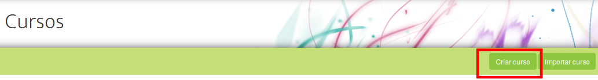

3. Uma janela aparecerá pedindo o **Nome do novo curso**. Insira o nome do curs o e confirme clicando no botão **Criar curso**. 

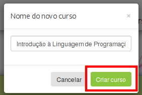

4. Clique em cada um dos campos para inserir os dados do curso e salve a cada alteração.

5. Salve o curso clicando no botão **SALVAR**. O curso ainda não está visível ao público, pois seu status está marcado como **RASCUNHO**, ou seja, visível apenas para você.

6. Para torná-lo público, selecione **PÚBLICO** em **ESTE CURSO É**.

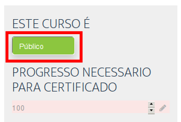

Campos da página inicial do curso
---------------------------------

Ao criar um curso, o administrador deverá preencher todos os campos obrigatórios. Caso algum campo não seja preenchido, ele será exibido vazio ao aluno. 

Veja a seguir a descrição de cada um dos campos. Para preenchê-los, basta clicar sobre eles e editá-los. 

Vejamos de forma geral os campos disponíveis de um curso:

1. **VÍDEO OU THUMBNAIL**: escolha o vídeo ou imagem (thumbnail) em destaque na página inicial do curso.
2. **HOME THUMBNAIL**: esse campo é para adicionar uma imagem do curso na página principal do site.

.. figure:: _static/professor/videothumbnailhome.png
   :scale: 100 %
   :alt: Campos do curso

3. **ESTE CURSO É**: aqui podemos decidir se o curso estará **Público**, para qualquer um acessar, ou se ainda está em fase de **Rascunho**. 

4. **PROGRESSO NECESSÁRIO PARA CERTIFICADO**: é possível definir uma quantidade mínima de realização do curso para que o aluno peça o certificado de participação.

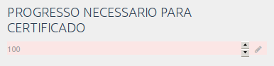

5. **DATA DE INÍCIO**: definição quando o curso terá início.

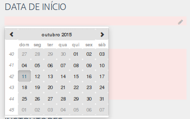

6. **RESUMO**: é uma apresentação sobre o curso e, embora o campo não tenha limite de texto, evite longas descrições.

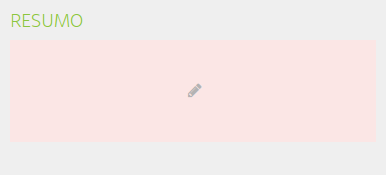

7. **INSTRUTORES**: nesse campo será listado os instrutores do curso.
8. **Organizar instrutores**: remova o instrutor ou adicione outros.
9. **ADICIONAR INSTRUTOR**: inclua um instrutor responsável pelo curso.

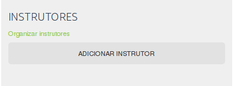

10. **POR QUE FAZER ESSE CURSO?**: descrição de quais são as aplicações dos conhecimentos adquiridos após a conclusão do curso, nos contextos profissional e social do aluno. Nossa sugestão é que o campo responda as seguintes perguntas: o que posso estudar agora? O que consigo fazer e em que posso trabalhar?

.. figure:: _static/professor/pqfazer.png
   :scale: 100 %

11. **O QUE EU PRECISO SABER?**: o conteúdo deste campo descreve dois tipos de requisitos
      * Quais os conhecimentos prévios necessários para realizar este curso.
      * Quais os requisitos de infraestrutura para realizar este curso.

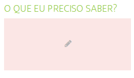

12. **ESTRUTURA DO CURSO**: campo para explicar a metodologia do curso, como serão oferecidas as aulas, quais os tipos de atividade, avaliação, enfim, quais os recursos de aprendizagens disponíveis.

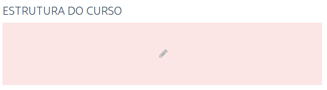

13. **AULAS**: aqui são inseridas as videoaulas e as atividades do curso.

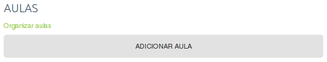

 
Como exportar/importar um curso
-------------------------------

Para importar um curso, é necessário antes exportar o conteúdo de um curso já existente. 

**Exportar um curso**

#. Acesse a página de **Cursos** do menu de **Administração** e clique no curso que deseje exportar.
#. No curso selecione, clique no botão **EXPORTAR** no canto superior esquerdo. O curso será baixado para o seu computador. Não altere a extensão final dele (**.tar.gz**), caso contrário não será possível fazer a importação posteriormente.

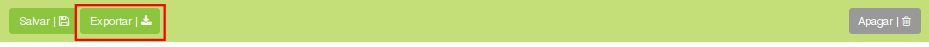

**Importar um curso**

#. Acesse a página de **Cursos** do menu de **Administração** e clique em **Importar curso** no canto superior esquerdo. 
#. Uma janela aparecerá com um campo para escolher o arquivo de importação. Localize o arquivo com extensão **.tar.gz** gerado na etapa de exportação e clique em **Importar curso**. 
#. Após a importação, a página será redirecionada para a edição do novo curso importado.

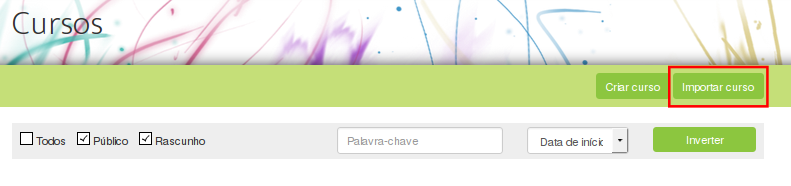

Como modificar a página inicial da plataforma
---------------------------------------------

As informações e os cursos exibidos na página inicial da plataforma podem ser customizados. 

1. Acesse o menu de **Administração** e clique em **Editar home**.

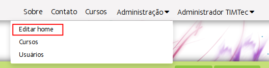

2. Na página de edição da home (página inicial) é possível escolher os cursos que serão exibidos (**Escolher cursos da home**), bem como organizar sua ordem de exibição (**Organizar cursos**). 

3. Para editar as informações sobre a plataforma e os outros campos, basta clicar em cima de cada um deles e clicar em **Salvar** na barra superior.

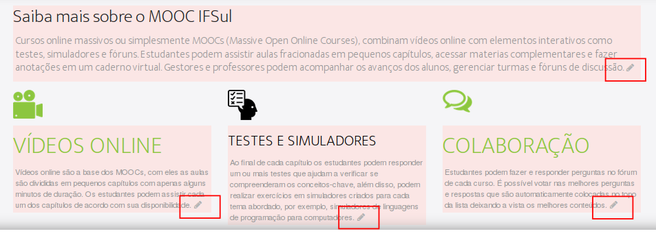

Escolhendo cursos da home
-------------------------

Para adicionar ou remover um curso na página principal da plataforma, 

#. Acesse o menu de **Administração** e clique em **Editar home**. 
#. Clique em **Escolher cursos da home** no menu superior.
#. Em seguida clique nos cursos desejados e depois em **"OK"** .

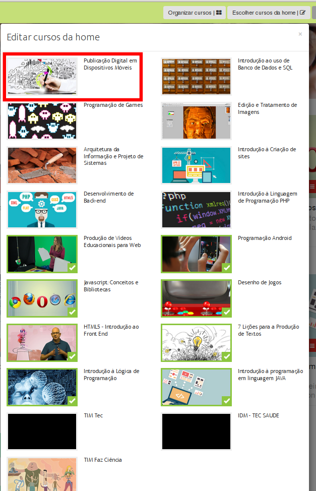

Organizando o posicionamento dos cursos da home
-----------------------------------------------

#. Acesse o menu de **Administração** e clique em **Editar home**. 
#. Em **Organizar cursos** basta clicar no ícone vermelho e arrastar para alterar a posição do curso na página. O título, autor e os outros dados serão automaticamente movidos para a nova posição.

.. figure:: _static/professor/editarhome3.png

Alterando o menu Sobre
----------------------

É possível alterar o **Sobre** com as informações a respeito da sua instituição.

#. Clique no menu do cabeçalho **Sobre**.
#. Ao clicar em cima do texto que está sendo exibido, uma janela de edição aparecerá.
#. Faça as mudanças necessárias e clique em **Salvar mudanças**.

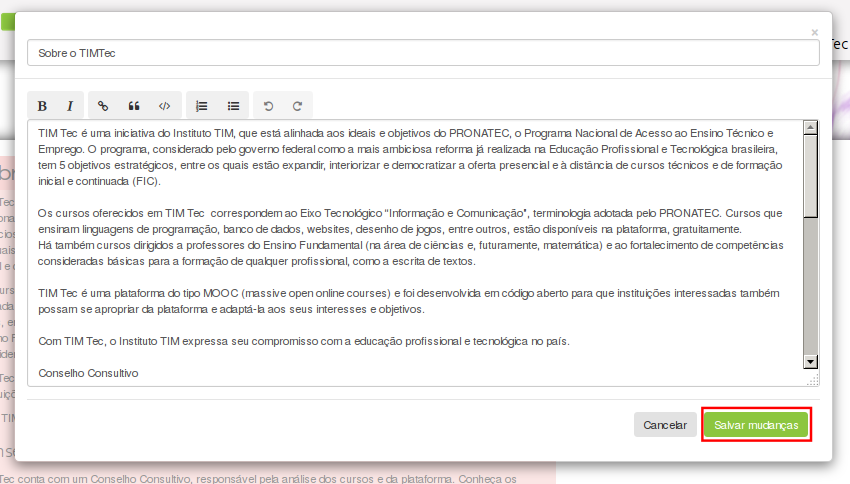

